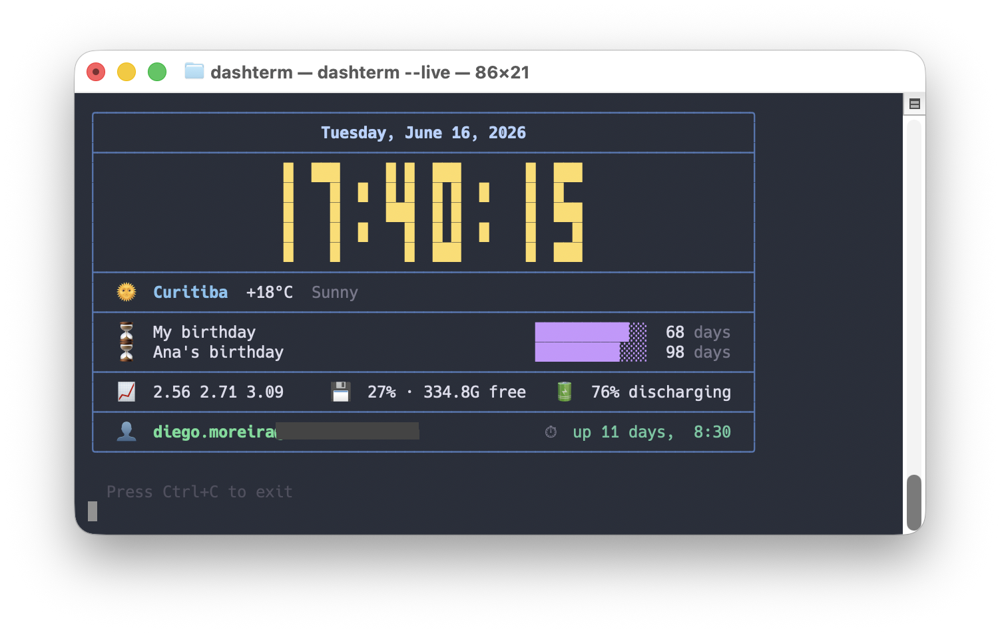

# dashterm

A lightweight terminal dashboard that displays clock, date, weather, countdowns, uptime, and user info every time you open a terminal.


## Requirements

- Python 3.9+ (uses standard-library generics like `tuple[...]`)
- No third-party dependencies, just pure Python standard library, nothing to `pip install`
- A Unicode/emoji-capable terminal with 24-bit (truecolor) support, for correct icons and alignment
- Internet connection (for weather — uses [wttr.in](https://wttr.in), no API key needed)

## Install

```bash
bash install.sh
```

The installer will:
1. Build a single-file executable and copy it to `~/.local/bin/dashterm`
2. Optionally add it to your `.bashrc` or `.zshrc`
3. Run the setup wizard (city, weather refresh period, clock style, theme, panels & countdowns)

`dashterm` is bundled into one self-contained executable with the standard-library
[`zipapp`](https://docs.python.org/3/library/zipapp.html) module — it runs anywhere
`python3` is available, with nothing to `pip install`.

## Manual install

```bash
bash build.sh                      # produces dist/dashterm
cp dist/dashterm ~/.local/bin/dashterm
chmod +x ~/.local/bin/dashterm
dashterm --setup
```

## Usage

| Command | Description |
|---|---|
| `dashterm` | Static snapshot, instant render |
| `dashterm --live` | Live clock, updates every second |
| `dashterm --setup` | Configure city, weather cache, clock style, theme, panels and countdowns |
| `dashterm --config` | Print the config file path and contents |
| `dashterm --version` | Show version |
| `dashterm --help` | Show help |

## Shell startup

Add to your `~/.bashrc` or `~/.zshrc`:

```bash
# dashterm — terminal dashboard
dashterm
```

## Config

Stored at `~/.config/dashterm/config.json`:

```json
{
  "city": "São Paulo",
  "show_weather": true,
  "use_color": true,
  "clock_style": "default",
  "theme": "default",
  "panels": ["clock", "weather", "countdowns", "system", "user"],
  "weather_cache_minutes": 30,
  "countdowns": [
    { "label": "New Year",       "date": "2027-01-01" },
    { "label": "Project Launch", "date": "2026-09-15" }
  ]
}
```

You can edit it directly or run `dashterm --setup` again.

- `city` — location used for the weather lookup.
- `show_weather` — set to `false` to hide the weather row entirely.
- `use_color` — set to `false` for plain, ANSI-free output (useful for logs or color-less terminals).
- `clock_style` — how the time is displayed: `default`, `large` or `ascii`.
- `theme` — color palette: `default`, `mono`, `nord` or `solarized`.
- `panels` — which sections to show and in what order. Available: `clock`, `weather`, `countdowns`, `system`, `user`. Remove an entry to hide it, or reorder the list to rearrange the dashboard.
- `weather_cache_minutes` — how long a fetched forecast is reused before hitting the API again (default `30`). Weather is cached at `~/.config/dashterm/weather_cache.json`, so opening a new terminal won't re-fetch until the cache expires.
- `countdowns` — list of `{ "label", "date" }` entries (date as `YYYY-MM-DD`), up to 5.

## Panels

The dashboard is composed of panels, rendered top-to-bottom in the order listed in `panels`:

| Panel | Shows |
|---|---|
| `clock` | Date and time (compact, or a large/ascii clock per `clock_style`) |
| `weather` | Current conditions for `city` (when `show_weather` is on) |
| `countdowns` | Progress bars and days remaining for each countdown |
| `system` | Load average, free disk, and battery |
| `user` | `user@host` and system uptime |

Empty panels are skipped automatically (e.g. `weather` with no city, or `system` where stats aren't available).

## Development

The code lives as a package under `src/dashterm/`. Run it straight from source — no install required:

```bash
PYTHONPATH=src python3 -m dashterm
```

Or do an editable install into a virtualenv (optional — gives you the `dashterm` command on PATH):

```bash
python3 -m venv .venv && source .venv/bin/activate
pip install -e .
```

Build the distributable single-file executable any time with `bash build.sh` → `dist/dashterm`.

### Project layout

```
src/dashterm/
├── cli.py          # arg parsing & entry point
├── config.py       # config file + defaults
├── cache.py        # weather cache
├── theme.py        # palettes & active colors
├── collectors.py   # gather raw data (clock, weather, system, …)
├── dashboard.py    # assemble panels into the framed output
├── wizard.py       # --setup wizard & --config viewer
├── render/         # display-width math, box drawing, clock fonts
└── panels/         # one module per panel + a registry
```

**Adding a panel:** create `panels/<name>.py` with a `build(cfg, width) -> list[str]`, register it in `panels/__init__.py`, and add its name to `DEFAULT_PANELS` (in `config.py`) if it should show by default.

## Notes

- Weather uses [wttr.in](https://wttr.in) — no account or API key required
- Uptime and the `system` panel (load average, disk, battery) work on Linux and macOS; on platforms where a stat isn't available it's simply omitted
- Colors use 24-bit ANSI — works in any modern terminal emulator

## Uninstall

```bash
# Remove the executable
rm -f ~/.local/bin/dashterm

# Remove your config & cache
rm -rf ~/.config/dashterm
```

Also delete the `dashterm` startup line from your `~/.bashrc` or `~/.zshrc` if you added one.

## License

[MIT](LICENSE)
